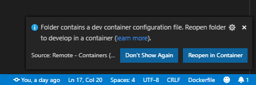

# Devcontainer

_The easiest way to contribute to and/or test this repository._

## Requirements

- [git](https://git-scm.com/book/en/v2/Getting-Started-Installing-Git)
- [docker](https://docs.docker.com/install/)
- [VS Code](https://code.visualstudio.com/)
- [Remote - Containers (VSC Extention)](https://marketplace.visualstudio.com/items?itemName=ms-vscode-remote.remote-containers)

[More info about requirements and devcontainer in general](https://code.visualstudio.com/docs/remote/containers#_getting-started)

## How to use Devcontainer for development/test

1. Make sure your computer meets the requirements.
1. Fork this repository.
1. Clone the repository to your computer.
1. Open the repository using VS Code.

When you open this repository with VSCode and your computer meets the requirements you are asked to "Reopen in Container", do that.

If you don't see this notification, open the command pallet (ctrl+shift+p) and select `Remote-Containers: Reopen Folder in Container`.

_It will now build the devcontainer._

The container have some "tasks" to help you testing your changes.

## Configuration

Make a copy of `.devcontainer\sample_configuration.yaml` and place it here `.devcontainer\configuration.yaml`

Add your github token to the new file.

## Custom Tasks in this repository

_Start "tasks" by opening the the command pallet (ctrl+shift+p) and select `Tasks: Run Task`_

Running tasks like `Start Home Assistant on port 8124` can be restarted by opening the the command pallet (ctrl+shift+p) and select `Tasks: Restart Running Task`, then select the task you want to restart.

### Start Home Assistant on port 8124

This will copy the configuration and the integration files to the expected location in the container.

And start up Home Assistant on [port 8124.](http://localhost:8124)

### Upgrade Home Assistant to latest dev

This will upgrade Home Assistant to the latest dev version.

### Set Home Assistant Version

This allows you to specify a version of Home Assistant to install inside the devcontainer.

### Home Assistant Config Check

This runs a config check to make sure your config is valid.