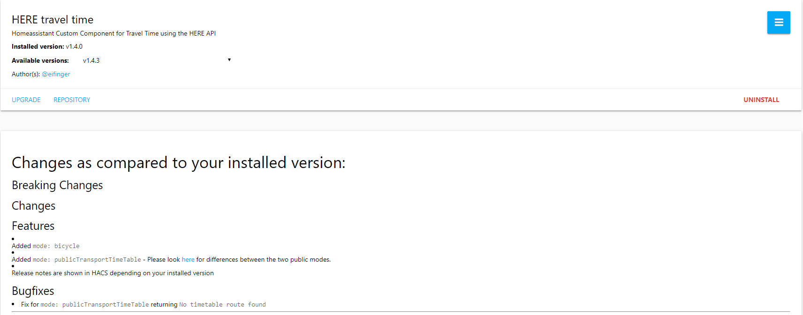
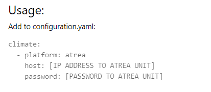

# Note for developers

For your repository to be added there are a few criteria that need to be met.

- See [Integration developer](../integration) for integrations.
- See [Plugin developer](../plugin) for plugins.

## Repository information

### Description

The description of the repository is also the same description that is shown in HACS.

### Topics

Repository topics are not displayed in HACS, but they can be used for searchablility in the HACS store.

## Versions

If the repository uses GitHub releases, the tagname from the latest release is used to set the remote version.

If the repository does not use those, the 7 first charachters of the last commit will be used.

## Enhance the experience

If you want to add a richer experience for your users you can add an `info.md` file to the root of your repository (this is optional), this file will be rendered under the repository description, it does not support the full styling options as Github so use with care.

### Templates

You can use Jijna2 templates to controll what and how the info is displayed.
In addition to the defaut templates of Jijna these are added:

Template value | Description
-- | --
installed | True / False if it is installed.
pending_update | True / False if a update is pending.
prerelease | True / False if it's a pre release.
selected_tag | The selected version.
version_available | The latest available version.
version_installed | The installed version

#### Examples

##### Prerelease

```yaml

## NB!: This is a Beta version!

```


##### [Here Travel Time](https://github.com/eifinger/here_travel_time/blob/master/info.md)

```yaml

# Changes as compared to your installed version:

## Breaking Changes

## Changes

## Features


- Added `mode: bicycle`
- Added `mode: publicTransportTimeTable` - Please look [here](https://developer.here.com/documentation/routing/topics/public-transport-routing.html) for differences between the two public modes.


- Release notes are shown in HACS depending on your installed version


## Bugfixes


- Fix for `mode: publicTransportTimeTable` returning `No timetable route found`

---

```



### Some examples of `info.md` files

#### [Compact Custom Header](https://github.com/maykar/compact-custom-header/blob/1.0.4b9/info.md)

  

#### [Lovelace Swipe Navigation](https://github.com/maykar/lovelace-swipe-navigation/blob/1.2.0/info.md)


#### [HomeAssistant-Atrea](https://github.com/JurajNyiri/HomeAssistant-Atrea/blob/2.1/info.md)  




### Want to add your repository to the store as a default?

[See here for how to add a custom repository.](../include_default_repositories)

## Badges

Tell your users that your repository can be tracked with HACS.

### Default repository

_If your repository is in the default store._

[](https://github.com/custom-components/hacs)

```
[](https://github.com/custom-components/hacs)
```

***

[](https://github.com/custom-components/hacs)

```
[](https://github.com/custom-components/hacs)
```

### Custom repository

_If your repository can be added as a custom repository._

[](https://github.com/custom-components/hacs)

```
[](https://github.com/custom-components/hacs)
```

***

[](https://github.com/custom-components/hacs)


```
[](https://github.com/custom-components/hacs)
```
