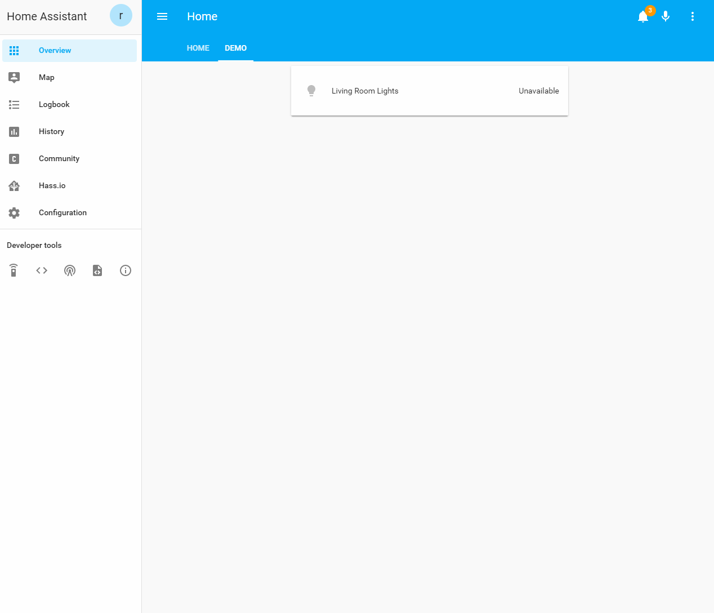
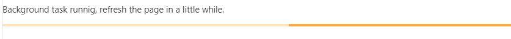

# HACS (Home Assistant Community Store)



***

## What can HACS do?

This is a manager for your custom Home Assistant needs.

It can help you download and update elements.

It can also help you discover new awesome stuff.

### What can it track/discover?

- Custom integrations (components/platforms/custom_component) for Home Assistant
- Custom plugins (cards/rows/mods) for Lovelace
- AppDaemon apps for [AppDaemon](https://appdaemon.readthedocs.io/en/latest/)
- Themes for the [frontend integration](https://www.home-assistant.io/components/frontend/) in Home Assistant
- "python_scripts" for the [`python_scripts` integration](https://www.home-assistant.io/components/python_script/) in Home Assistant

## Updates

### Installed elements

HACS will check for updates to installed elements:

- At startup.
- Every 30 minutes after HA startup.

### Everything else

HACS will check for updates to every element:

- At startup
- Every 500 minutes after HA startup.

### Manually trigger updates

You can also force a check by clicking the "RELOAD DATA" button under the "SETTINGS" tab _(This will force a reload of everything.)_

Under the "SETTINGS" tab there is also a reload icon to the left of every custom repository you have added, clicking that will reload info for it.

On each RepositoryView (the page with details about the element) there is a reload icon at the top-right corner, clicking that will reload it.

## Logs

Like any other integration this logs to the `home-assistant.log` file.

You can also click the "OPEN LOG" from the "SETTINGS" tab to show logs only related to this integration (useful when creating a issue)

To enable `debug` logging, add this to your `configuration.yaml`:

```yaml
logger:
  default: info
  logs:
    custom_components.hacs: debug
```

## Startup

During the startup it will scan for know repositories, and there will be a progressbar indicating that it's working.



This is completely normal, and you can still use it while it's working.
The same indication will show when a scheduled task is running.

## Existing elements

This will not scan you local file system for existing elements.

Why?

Trust. If this did not download it, there'd be no way to know which version you have, so for elements you already have you will still need to click the "INSTALL" button for that element.

## Debug logging

Add this to your `configuration.yaml` to enable debug logging for HACS.

```yaml
logger:
  default: info
  logs:
    hacs: debug
```

## Local data storage

All data it handles are saved to `hacs.*` files that is located under `.storage`

## HACS Sensor

During the setup HACS will add a new sensor to your installation (`sensor.hacs`).
This will have the number of pending updates as the state.


***

## Contribute

This integration is **massive** and there are a lot of areas to contribute to.

Contributions to the docs, will almost be blindly accepted.

_Contributions for the documentation should go against the `master` branch._

### For contributions to the integration itself (backend/frontend)

_Contributions for the integration should go against the `master` branch._

If the contribution is minor, make the change and open a PR (Pull Request).

For new features, changes to existing features, or other big changes, please open an RFC (Request for comment) issue before you start the work.

### Devcontainer

[The easiest way to contribute is to spin up a devcontainer.](https://code.visualstudio.com/docs/remote/containers) with VSCode, it has all the tools you need included, and it does not interfare with your system.

**Requirements:**

- Docker
- VS Code
- Remote - Containers (VS Code extention)

Make your changes, then run the task "Start Home Assistant" to test them, HA will run on port 8124.

***

## Last notes from the initial developer

First startup after installation will take some time, but it's worth it.

This was developed under the influence of 🍺, a lot of 🍺, [if you want to support my work feel free to buy me a ☕️ (most likely 🍺)](https://buymeacoffee.com/ludeeus)

How it works and what it does are added based on a single persons mindset, you may not agree with what I have done, if you have a suggestion please open an [RFC](https://github.com/custom-components/hacs/issues).

## Bugs / issues / suggestions

If you find bugs/issues or have any suggestions please open an issue in the [HACS Repository](https://github.com/custom-components/hacs/issues)