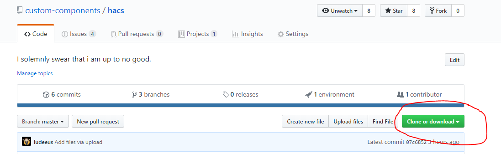
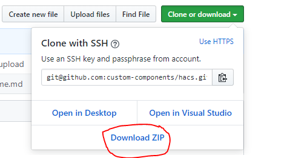
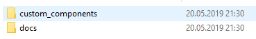

***

[HOME](/hacs/) | [**INSTALLATION**](/hacs/install) | [CONFIGURATION](/hacs/configure) | [TOKEN](/hacs/token)

***
# Installation

**NB!: You need to use Home Assistant version 0.92.0 or newer for this to work.**

**NB!: If you move from [`custom_updater`](https://github.com/custom-components/custom_updater) to this see the special note at the bottom here.**

**NB!: You need to have added `logger:` to your `configuration.yaml` for this to work.**

This integration requires **a lot** of files.

The easiest way to make sure that you have them all is to download the `.zip` file from the repo.

[Not a fan of reading, direct link here.](https://github.com/custom-components/hacs/archive/master.zip)

## Step 1 - Open browser

_You are probably looking at this in a browser, so we can probably check this off._

## Step 2 - Go to the HACS repo

https://github.com/custom-components/hacs

## Step 3 - Open menu

Open the download menu by clicking the "Clone or download" button.

## Step 4 - Initialize Download

Initialize the download by clicking the "Donwload ZIP" button.

## Step 5 - Extract the content

There should now be a `hacs-master.zip` file in your Download folder.

You need to unzip this, before preceding.

## Step 6 - Move along

Now that you have extracted all the files you will see something like this:

in the `custom_components` named, there is a folder named `hacs`.

The folder named `hacs` would need to be copied to your Home Assistant installation.

For this use your favorite tool to get stuff to Home Assistant.

If this is your first custom_component you would need to create a new folder (see step 7).

If this is not your first, you should know where to place the `hacs` folder, and if this is not your first why are you reading this? you have done this earlier and should know this by now :D

Anyway the `hacs` folder needs to be placed under `<conifg_dir>/custom_components/`

On Hassio the final location will be `/config/custom_components/hacs`

On Hassbian the final location will be `/home/homeassistant/.homeassistant/custom_components/hacs`

## Step 7 - (Bonus)

If you are a seasoned user, skip to step 8.

Cool you are still reading.

Open the folder where you have your `configuration.yaml` file.
Don't open that file (yet) just the folder for now.

If you see a folder named `custom_components` there, go back to Step 7 if you think you need to do something here.

If you **do not** see a `custom_components` folder in **the same** folder as `configuration.yaml`, you need to create it.

The `custom_components` **needs** to be in **the exact same** folder as `configuration.yaml`

## Step 8 - ✏️

[You should now be done, next part will be to add it to your configuration.](https://custom-components.github.io/hacs/configure)

# Moving from [`custom_updater`](https://github.com/custom-components/custom_updater)

If you have [`custom_updater`](https://github.com/custom-components/custom_updater) installed you need to remove that (rename the directory or delete it completely)

This and [`custom_updater`](https://github.com/custom-components/custom_updater) can not operate on the same installation.

If you used the special endpoint `/customcards/` endpoint for your Lovelace cards, you now need to reinstall that plugin using HACS and use the url provided in the page for that plugin in the HACS UI, if the plugin is not there you need to use `/local/` insted.

As noted under ['Existing elements'](/hacs#existing-elements) You need to click the "INSTALL" button for each element you previously have installed.