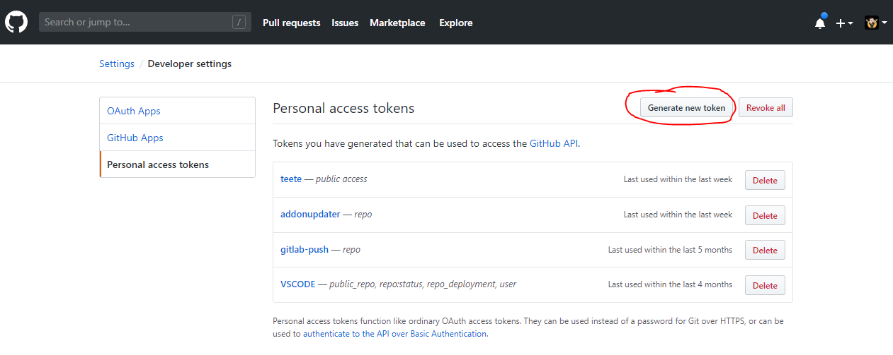
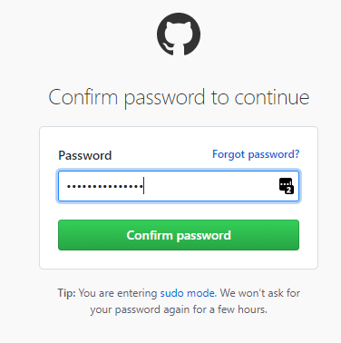
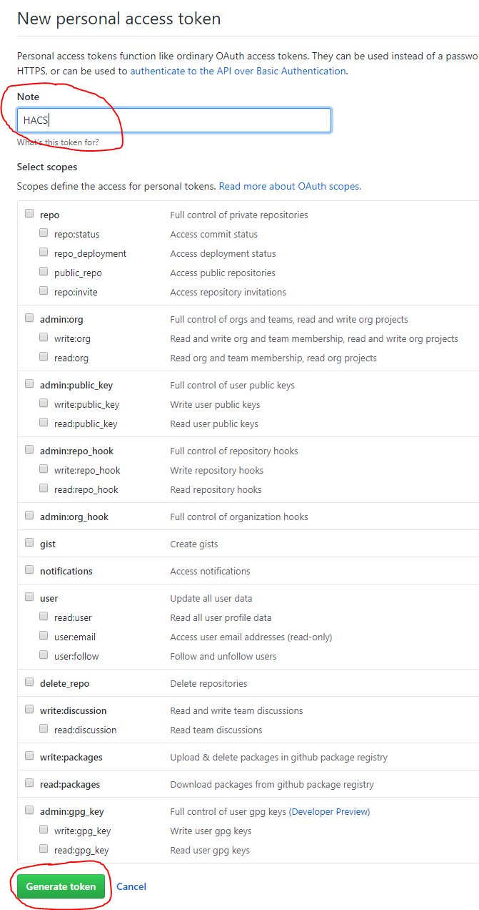
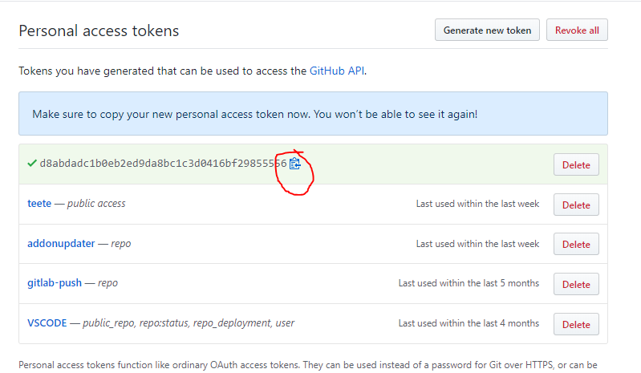

***

[HOME](/hacs/) | [INSTALLATION](/hacs/install) | [CONFIGURATION](/hacs/configure) | [**TOKEN**](/hacs/token) | [FAQ](/hacs/faq)

***
# Github Personal Access Token

_You need to generate an Access Token to your account before you start using this._

## Step 1 - Open browser

_You are probably looking at this in a browser, so we can probably check this off._

## Step 2 - Go to your GitHub Developer settings

_And then "Personal access tokens._
or click here https://github.com/settings/tokens

## Step 3 - Start generation

Click the "Generate new token" button.

_If you are asked to login, do so._

## Step 4 - Choices

First give it a logical name so that you can recognise it.

Then click the "Generate token" button at the bottom.

You **do not** need to check _any_ of the boxes.

## Step 5 - Copy

Now you see the generated token, this will be the **only** time you see it, make sure that you copy it manually or by clicking the clipboard icon.

