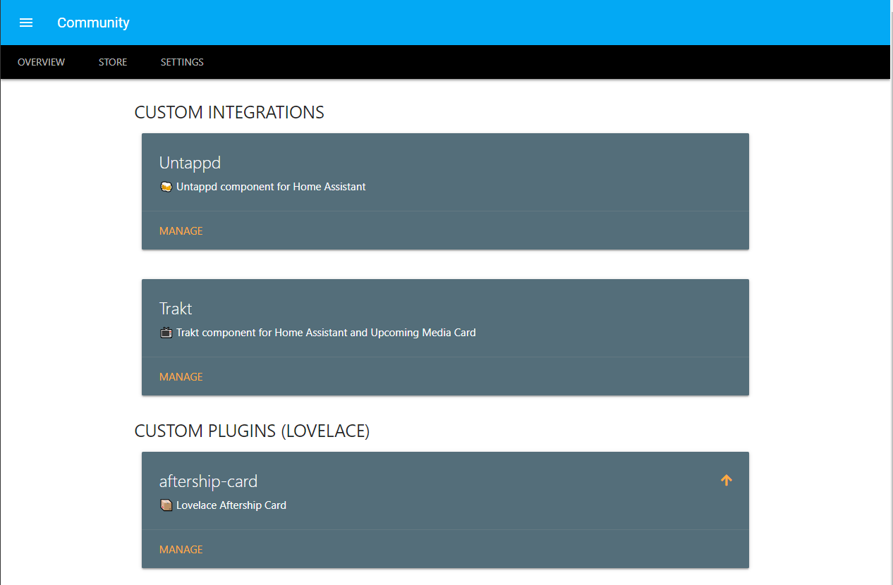

# Overview

_During startup HACS loads all known repositories, when it does you will see a progressbar at the top of the page, if will not go away on it's own, try refreshing the bowers window after a couple of minutes._

The overview tab in HACS contain all the repositories HACS manages that you have installed.

To change the layout have a look at the [HACS Display option](../settings/#hacs-option-display).

The repositories are sorted by type.

If you click anywhere on the card you will get to the [Repository view](./repository.md) of that repository.

## Card elements

Every repository is represented as a card, each card contains 3 elements.

### Title

At the top of the card there is a title for the repository.

### Description

Below the title there is a description for the repository.

### Repository status

The status icon give you a quick indication of the status of the repository.

color | description
-- | --
Green | The repository is installed and there is no pending actions.
Orange | There is an update pending.
Read | There is an restart pending.
No color (the default text color of the theme) | Repository is not installed/managed by HACS.

<!-- Disable sidebar -->

<!-- Disable sidebar -->