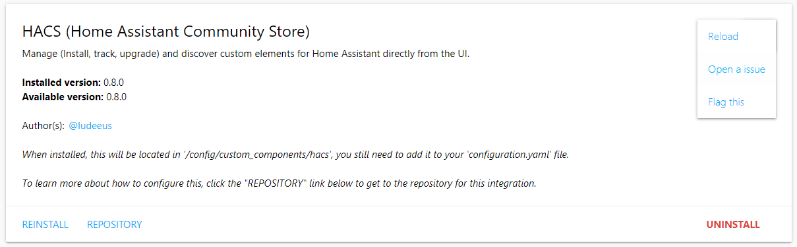

# Repository

_During startup HACS loads all known repositories, when it does you will see a progressbar at the top of the page, if will not go away on it's own, try refreshing the bowers window after a couple of minutes._

The repository view will be different depending on:

- The state of the repository.
- The type of repository.
- What the developer have added to the repository.

## General structure

## Menu (To the right in the view)

### Reload

This will reload the information about this repository.

### Hide/Show Beta

Define if you want to hide/show beta releases (pre-releases) from the repository.
This will only show if the repository uses releases.

### Hide

This will hide this repository from the overview/store.
HACS does not update information about hidden repositories.

To unhide a hidden repository go to the settings tab.

### Open a issue

This will take you to the issue tracker for that repository.

### Flag this

HACS have a blacklist of repositories, use this option to get to a issue template in the HACS repository where you suggest that the repository is added to that list and why.

## Buttons/Links

### Main action

This button will have a different name depending of the state of the reopsitory.

- If not installed it will say "Install".
- If an update is pending it will say "Upgrade".
- If it is installed and no update is pending it will say "Reinstall".

Clicking this will start the installation of the newest version.

### Changelog

This will take you to the release page for the repository.
This will only show if there is an update, and only if the repository uses GitHub Releases.

### Open plugin

Open the downloaded plugin file for inspection.
This will only show for installed plugins.

### Repository

This will take you to the GitHub repository for the repository.

### Uninstall

This will delete the files on the file system and tell HACS that you do not want to keep tracking it.
This will only show on installed repositories.

<!-- Disable sidebar -->

<!-- Disable sidebar -->