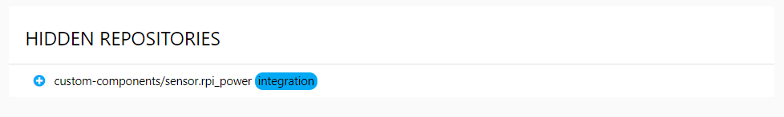

# Settings

_During startup HACS loads all known repositories, when it does you will see a progressbar at the top of the page, if will not go away on it's own, try refreshing the bowers window after a couple of minutes._

## HACS Information

At the top of the settings page you will see the current version of both HACS and Home Assistant.

### HACS Option: `Display`

This setting changes how both "OVERVIEW" and "STORE" looks, you can choose between `Grid` and `Table`.

#### Grid

#### Table

## Add custom repositories

By default all elements that meet the requirements from these orgs are automatically added:

- [custom-components](https://github.com/custom-components)
- [custom-cards](https://github.com/custom-cards)

[_Developers can also add their repositories to be included by default_](../../developer/include_default_repositories)

But you can add any other repository that meets the requirements, to do so go to the "SETTINGS" tab.

Add the url to the repository under "CUSTOM REPOSITORIES" and select a `type` before clicking the "save icon".

Type | Description
-- | --
`Appdaemon` | Apps for AppDaemon
`Integration` | Integrations for Home Assistant (custom_components)
`Plugin` | Pugins for Lovelace (cards, mods, elements, rows and so on.)

After adding a repository the repository will be scanned, if it can be tracked the element will show up under "STORE", and you will be redirected to that element.

Want to get inspiration on what to add? Check out the [Awesome Home Assistant list](https://www.awesome-ha.com/) it contains links to many custom_components (integrations) and custom_cards (plugins).

_If you have added a repository manually and that repository is subsequently added to the 'store' then that will be removed from the custom repository list._

## Hidden repositories

This is a list of all your hidden repositories.  
Click the "+" icon to the left to unhide them.

